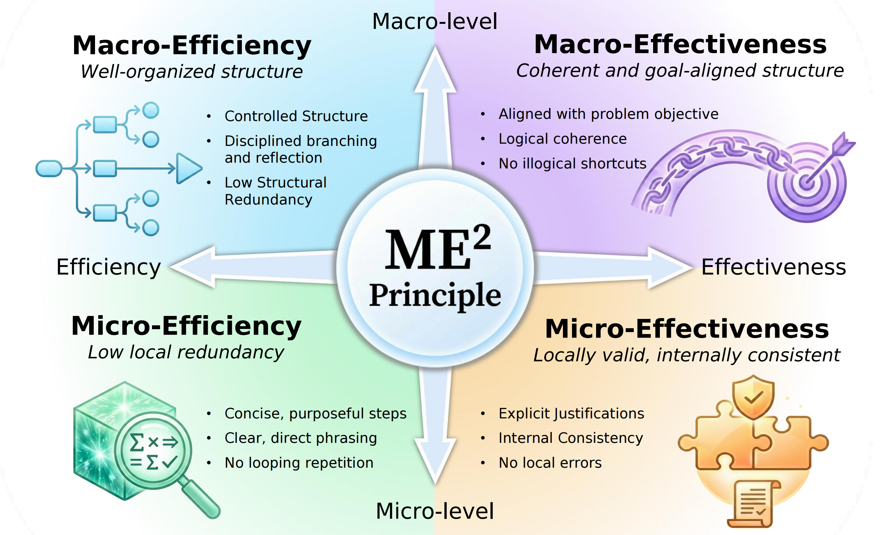
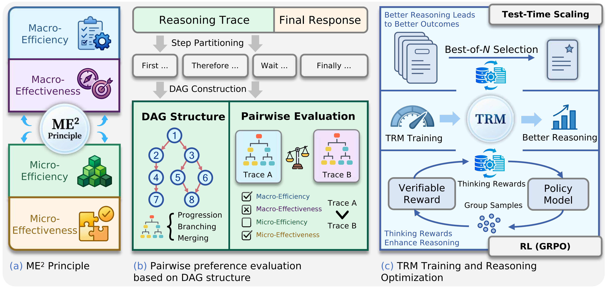
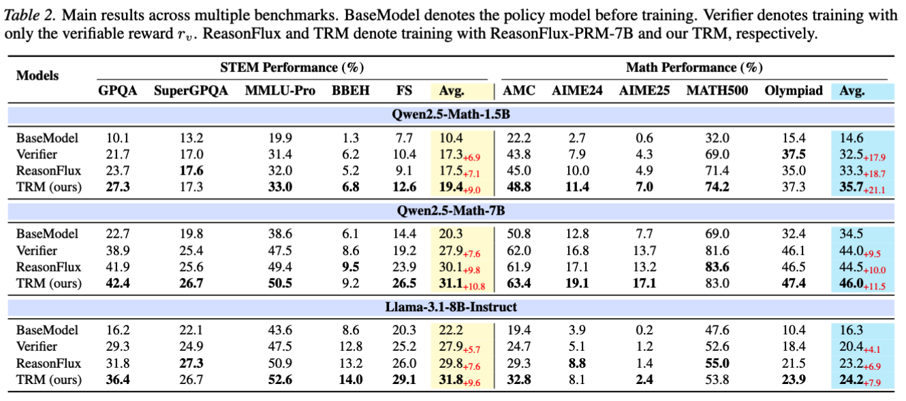
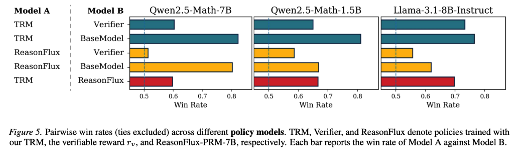

<div align="center" style="margin-top:0; padding-top:0;">
  <h1 style="margin-top:0; padding-top:0;">
    Characterizing, Evaluating, and Optimizing <br> Complex Reasoning
  </h1>
  <h4>
    <a href="https://arxiv.org/abs/2602.08498">
      
    </a>
    <a href="https://huggingface.co/zzzhr97/TRM-8B">
      
    </a>
    <a href="https://huggingface.co/datasets/zzzhr97/TRM-Preference">
      
    </a>
  </h4>
</div>


This repository provides the TRM-Preference dataset, TRM weights, and implementations for TRM training and TRM-guided policy optimization.

The **Thinking Reward Model (TRM)** evaluates the quality of *reasoning traces* rather than final answers. We study how to optimize reasoning itself: instead of only asking “Is the answer correct?”, we ask:

> **Is this a good way to think?**

We characterize reasoning quality with four dimensions (the ME² principle), enabling supervision beyond answer correctness.:

* **Macro-Efficiency**: global structure is disciplined (no unnecessary branching/restarts).
* **Macro-Effectiveness**: global structure stays coherent and aligned with the goal.
* **Micro-Efficiency**: individual steps are concise and non-redundant.
* **Micro-Effectiveness**: individual steps are locally valid and consistent.

<p style="text-align: center;">
  
</p>

The main process:

<p style="text-align: center;">
  
</p>

## Install required packages
```bash
pip install torch==2.8.0 --index-url https://download.pytorch.org/whl/cu126
pip install -e ./verl-0.6.0
pip install ninja
pip install flash-attn==2.8.1 --no-build-isolation
pip install vllm==0.11.0
pip install sglang==0.5.2
pip install numpy==1.26.4
pip install transformers==4.56.1
pip install flashinfer-python
pip install math-verify
```

## TRM Scoring

Download our TRM:

```bash
huggingface-cli download zzzhr97/TRM-8B --local-dir <local-path>
```

We use sglang to host the TRM server. Configure the path in `trm.sh` and run:

```bash
bash trm.sh
```

Use TRM to score reasoning:

```python
import requests
import json

with open("sample.json", "r", encoding="utf-8") as f:
    sample = json.load(f)
prompt = sample["prompt"]
response = sample["response"]

# Score the reasoning trace (before the termination marker).
reasoning = response.split("</think>", 1)[0]
input_text = f"{prompt}\n{reasoning}"

payload = {"model": "RewardModel", "input": input_text}
resp = requests.post("http://<TRM_HOST>:<TRM_PORT>/v1/embeddings", json=payload, timeout=60)
resp.raise_for_status()
score = resp.json()["data"][0]["embedding"][0]
print("TRM score:", score)
```

## TRM Training

Download training dataset:

```bash
huggingface-cli download zzzhr97/TRM-Preference --local-dir <local-path>
```

Configure the path in `train_rm.sh` and begin training:

```bash
bash train_rm.sh
```

## RL Training

### Prepare data and models

Download general-verifier for verification:

```bash
huggingface-cli download TIGER-Lab/general-verifier --local-dir <local-path>
```

Download training dataset:

```bash
huggingface-cli download zzzhr97/WebInstruct-Verified-Processed --local-dir <local-path>
```

### Training

Configure the path in `server/general-verifier.sh` and host the general-verifier:

```bash
bash server/general-verifier.sh
```

Set the endpoints `DEFAULT_VERIFIER_BACKENDS` and `DEFAULT_RM_BACKENDS` in `remote_verifier.py`.
Then, configure training script `train.sh` and begin training:

```bash
bash train.sh
```

## Results

**RL gains across benchmarks.** TRM-guided training improves performance, showing that thinking rewards provide useful shaping beyond binary correctness.

<p style="text-align: center;">
  
</p>

**Reasoning quality improves.** Policies trained with TRM achieve higher win rates in pairwise trace evaluation, indicating better reasoning behaviors under the ME² dimensions.

<p style="text-align: center;">
  
</p>

## Acknowledgements

This repo builds on open-source efforts, especially:

* `https://github.com/TIGER-AI-Lab/General-Reasoner`
* `https://github.com/verl-project/verl`

## Citation

```
@article{zhang2026characterizing,
  title={Characterizing, Evaluating, and Optimizing Complex Reasoning},
  author={Zhang, Haoran and Li, Yafu and Wang, Zhi and Wang, Zhilin and Zhang, Shunkai and Qu, Xiaoye and Cheng, Yu},
  journal={arXiv preprint arXiv:2602.08498},
  year={2026}
}
```